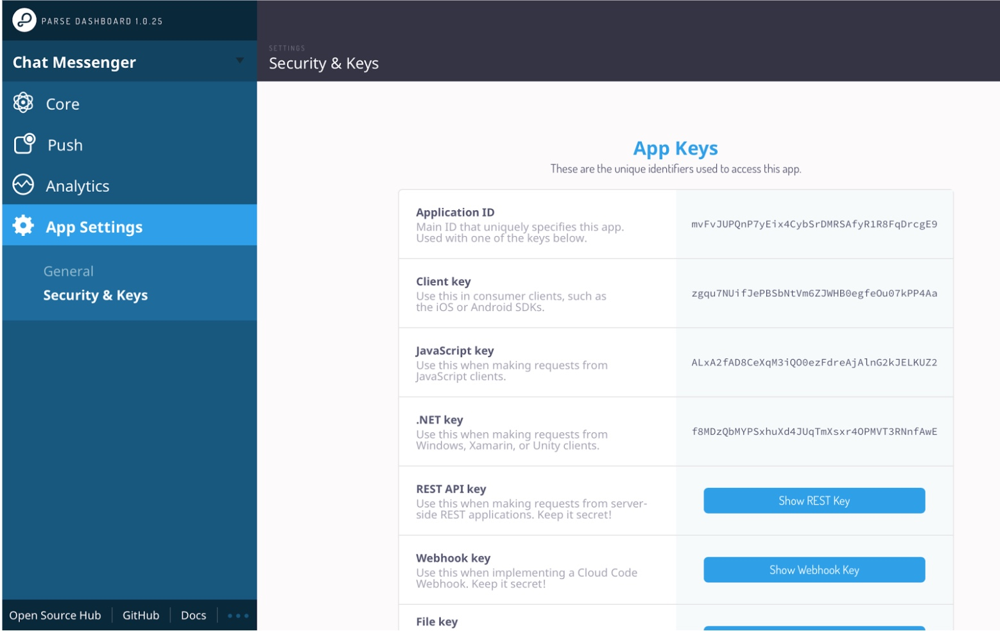

# msgr-back4app-android

**Ahoy Back4app community!**
This is a guest post by Virgil Security: we’re the tech behind [Twilio’s End-to-End Encrypted Messaging][_twilio]. We’ve been asked by our friends @ Back4app to show you how to build an End-to-End encrypted chat app on top of Back4app.

In this post, we’ll walk you through the steps to make [Back4app’s Android Simple Messenger app][_back4app] End-to-End Encrypted! Are you ready? Or if you don’t care about the details, you can simply skip to the end of the post and download the final product.

## What is End-to-End Encryption?

First, let’s start with a quick refresher of what E2EE is and how it works. E2EE is simple: when you type in a chat message, it gets encrypted on your mobile device (or in your browser) and gets decrypted only when your chat partner receives it and wants to display it in her chat window.

[image]

So essentially, the message remains encrypted while travels over wifi, the internet, gets on the web server, goes into the database and on the way back to your chat partner. In other words, none of the networks or servers have a clue of what the two of you are chatting about.

[another image]

What’s difficult in End-to-End Encryption is the task of managing the encryption keys: managing them in a way that only the users involved in the chat can access them and nobody else. Also, it’s tricky to implement crypto on 3 platforms with 3 different libraries and various levels of operating system support. You’d also have to consider what type of encryption you need use for the data you want to encrypt (for example, some encryption algorithms are built for encrypting keys, while some for encrypting text, while others for encrypting images). And these are just 3 examples of why developers end up not implementing crypto.

This blog post is about how to ignore all these annoying details and just End-to-End Encrypt using Virgil’s SDK that does it all for you.

**For an intro, this is how we’ll upgrade Back4app’s messenger app to be End-to-End Encrypted:**
1. During sign-up: we’ll generate individual private & public key for new users (public keys for encryption, private keys for decryption).
2. Before sending a chat message, you’ll encrypt it with the destination user’s public key,
3. When receiving a message, you’ll decrypt it with your app user’s private key.

The user public keys, we’ll publish to Virgil’s public key directory for chat users to be able to look up; the private keys will be kept on the user devices.

This is the simplest implementation for E2EE chat and it works perfectly for simple chat use-cases where users aren’t joining and leaving existing chat channels all the time. For a busier, Slack-like chat implementation, we’ll build a Part II for this post: [sign up here if you’re interested][_next_post] and we’ll ping you once we have it.

**OK, enough talking! Let’s get down to coding.**

- We’ll start by setting up Back4app’s messenger app,
- Then, we’ll show you how to End-to-End Encrypt it!

**Prerequisites:**

- Sign up for a [Back4app account][_back4app_account] and create a new app;
- You’ need [Android Studio][_android_studio] for the coding work, we used 3.0.1.

## Step 1: let’s set up the Back4app messenger app

### Import Project in Android Studio:
  - File -> New -> Project from Version Control -> Git
  - Git Repository URL: https://github.com/VirgilSecurity/chat-back4app-android
  - Check out the “cleanChat” branch

The project will look like this:
**Note!** Choose “Project” type of file tree - it will be used all-through the tutorial.

Set up the app with the credentials from your new Back4App app’s dashboard:

Open /app/src/main/res/values/strings.xml in the project and paste in your app credentials:

  - Go to your App Dashboard at Back4App website.
  - Open “Server Settings” of your app -> In “Core Settings” tile choose “Settings”.
  - Return to your strings.xml file and paste your “App Id” into “back4app_app_id” and “Client Key” into “back4app_client_key”.
To get live updates for messages and chat threads you have to enable Live Query. Live Query can be enabled for any custom class user created, so firstly - Launch the “Data Managment” for your app and create two classes “Message” and “ChatThread”:

After you successfully created “Message” and “ChatThread” classes you should enable Live Query. Open Live Query Settings and check the “Activate Hosting” option. Also you have to enter “Subdomain name” which can be any string you want and activate Live Query for recently created classes “Message” and “ChatThread”:

[_twilio]: https://www.twilio.com/blog/2016/05/introducing-end-to-end-encryption-for-twilio-ip-messaging-with-virgil-security.html
[_back4app]: https://docs.back4app.com/docs/new-parse-app/simple-messenger/
[_next_post]: https://virgilsecurity.us13.list-manage.com/subscribe?u=b2d755932a192a668f143411a&id=d2891963f1
[_back4app_account]: https://www.back4app.com/
[_android_studio]: https://developer.android.com/studio/index.html
